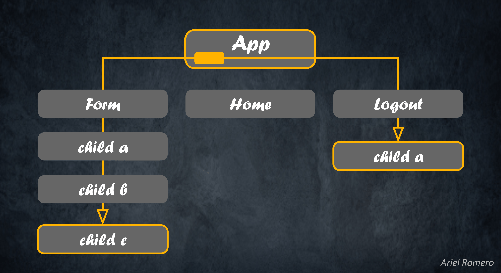
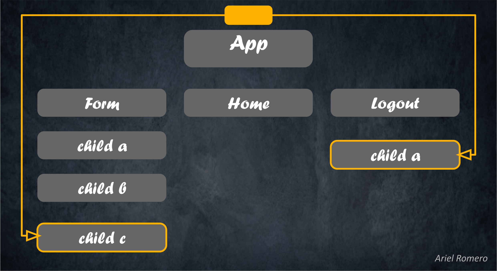

# AI Driven y organización de proyectos

## 🔹 Problema: el manejo de estados en React

- El manejo de estados dentro de los componentes es esencial en el desarrollo con React.
- Normalmente, podemos pasar estados desde un componente padre a sus hijos cuando estos los necesitan.
- Sin embargo, en algunos casos el componente que necesita el estado está muy alejado en el árbol de componentes, lo que trae varios problemas:
  - ❌ Mayor complejidad en el código (más difícil de leer y mantener).
  - ❌ Menor eficiencia en la aplicación.
  - ❌ Prop drilling: pasar props a componentes intermedios que ni siquiera las usan.
- 👉 Esto hace que el código sea menos escalable y mantenible.

### 📌 Ejemplo de Prop Drilling

- Imaginemos que en el componente App guardamos el estado del usuario logueado.
- Desde App necesitamos pasar el id del usuario al componente "Child C", que está en la rama de "Form".
- Al mismo tiempo, debemos pasar el manejador de estado al componente "Child A", que forma parte de la rama de "Logout", para permitir que este desloguee al usuario.
- 📉 Para lograrlo, terminamos pasando props a través de muchos componentes intermedios que no usan esos datos.
- Es como si quisiéramos entregar un paquete 📦 a una persona, pero en vez de dárselo directamente, se lo tenemos que pasar a todos los vecinos de la cuadra hasta que llegue a destino.

## 🚀 Solución: React Context

### ⚛️ React Context nos permite crear un estado global que:

- ✅ No están atados a un componente en particular (sino al Provider que los expone).
- ✅ Puede ser accedido directamente por cualquier componente que lo necesite.
- ✅ Evita el prop drilling.

### ✨ En nuestro ejemplo:

- Creamos un contexto de usuario.
- "Child C" puede obtener el id del usuario directamente desde el contexto.
- "Child A" puede acceder al manejador de logout sin necesidad de recibir props desde App.

### 📚 Cómo funciona

- Context Provider (Proveedor) → Crea y gestiona el estado que queremos compartir.
- Context Consumer (Consumidor) → Cualquier componente que necesite ese estado puede acceder a él.

### ⚛️ Aclaraciones

- React Context NO crea estados por sí mismo.
- Context lo único que hace es compartir un valor (cualquier dato: número, string, objeto, función, etc.) entre componentes, sin necesidad de pasar props manualmente.
- Ese valor puede ser un estado, pero el estado en sí sigue perteneciendo al componente Provider.
- El estado se crea en el componente donde definimos el useState (ej: en UserProvider).
- El Context sirve como un "canal" 📡 que hace que ese estado se pueda usar en todo el árbol de componentes, como si fuera global.
